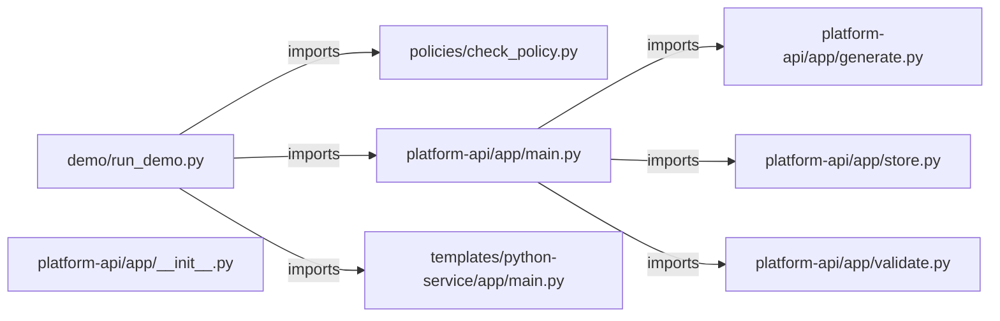
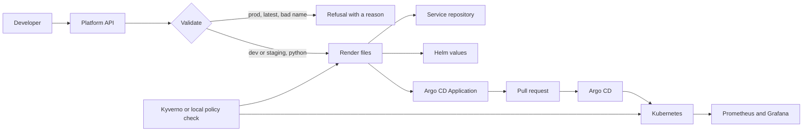

# customer-deployment-platform — project architecture

[README](README.md) · [Interview questions and answers](INTERVIEW_QA.md)

## Purpose and scope

Meridian Labs came with a queue, not a tool request.

This document describes files and symbols in this checkout. Deployment templates and statements in the original overview are distinguished from a verified running environment.

## Component diagram



For Python repositories, arrows show resolved local imports, not network calls or deployment order. Otherwise the diagram is a repository component map; containment arrows do not assert runtime integration.

## Components and responsibilities

| Component | Responsibility |
| --- | --- |
| [`platform-api/app/main.py`](platform-api/app/main.py) | HTTP handlers: `GET /healthz`, `GET /metrics`, `GET /`, `GET /services`, `GET /services/{request_id}` |
| [`templates/python-service/app/main.py`](templates/python-service/app/main.py) | HTTP handlers: `GET /healthz`, `GET /readyz` |
| [`platform-api/app/generate.py`](platform-api/app/generate.py) | Functions: `_fill`, `render_service` |
| [`policies/check_policy.py`](policies/check_policy.py) | Functions: `check_documents`, `main` |
| [`platform-api/app/validate.py`](platform-api/app/validate.py) | Functions: `_name_ok`, `refusals_for` |
| [`platform-api/app/store.py`](platform-api/app/store.py) | Functions: `__init__`, `_read`, `_write`, `find_by_key`, `get`, `list`, `add` |
| [`platform-api/requirements.txt`](platform-api/requirements.txt) | Implementation or supporting configuration |
| [`templates/python-service/requirements.txt`](templates/python-service/requirements.txt) | Implementation or supporting configuration |
| [`terraform/environments/local/main.tf`](terraform/environments/local/main.tf) | Terraform resource/module declarations |
| [`terraform/modules/service/main.tf`](terraform/modules/service/main.tf) | Terraform resource/module declarations |
| [`terraform/modules/service/outputs.tf`](terraform/modules/service/outputs.tf) | Terraform resource/module declarations |
| [`terraform/modules/service/variables.tf`](terraform/modules/service/variables.tf) | Terraform resource/module declarations |
| [`demo/run.sh`](demo/run.sh) | Implementation or supporting configuration |
| [`demo/run_demo.py`](demo/run_demo.py) | Functions: `main` |
| [`scripts/dev-up.sh`](scripts/dev-up.sh) | Implementation or supporting configuration |
| [`scripts/install-argocd.sh`](scripts/install-argocd.sh) | Implementation or supporting configuration |
| [`scripts/kind-up.sh`](scripts/kind-up.sh) | Implementation or supporting configuration |
| [`scripts/simulate-failure.sh`](scripts/simulate-failure.sh) | Implementation or supporting configuration |
| [`platform-api/app/__init__.py`](platform-api/app/__init__.py) | Implementation or supporting configuration |
| [`docker-compose.yml`](docker-compose.yml) | Container build/service configuration |
| [`platform-api/Dockerfile`](platform-api/Dockerfile) | Container build/service configuration |
| [`templates/python-service/Dockerfile`](templates/python-service/Dockerfile) | Container build/service configuration |

## Existing design and operating guides

These checked-in guides provide the project’s detailed design, operational context, or deployment view:

- [`docs/architecture.md`](docs/architecture.md).
- [`docs/troubleshooting.md`](docs/troubleshooting.md).

### Existing deployment/design view

The following view is retained from [`docs/architecture.md`](docs/architecture.md). Read that guide for its assumptions and the distinction between configured and deployed components.



## Request interface

| Method and path | Handler | Source |
| --- | --- | --- |
| `GET /healthz` | `healthz` | [`platform-api/app/main.py`](platform-api/app/main.py#L29) |
| `GET /metrics` | `metrics` | [`platform-api/app/main.py`](platform-api/app/main.py#L33) |
| `GET /` | `portal` | [`platform-api/app/main.py`](platform-api/app/main.py#L49) |
| `GET /services` | `list_services` | [`platform-api/app/main.py`](platform-api/app/main.py#L56) |
| `GET /services/{request_id}` | `get_service` | [`platform-api/app/main.py`](platform-api/app/main.py#L60) |
| `POST /services` | `create_service` | [`platform-api/app/main.py`](platform-api/app/main.py#L67) |
| `GET /healthz` | `healthz` | [`templates/python-service/app/main.py`](templates/python-service/app/main.py#L7) |
| `GET /readyz` | `readyz` | [`templates/python-service/app/main.py`](templates/python-service/app/main.py#L12) |

The table lists literal route decorators found in the inspected Python modules. Router prefixes and middleware can add behavior; check the linked handler and application setup before calling an endpoint.

## Implementation walkthrough

### `render_service(row: dict, data_dir: Path)`

Source: [`platform-api/app/generate.py`](platform-api/app/generate.py#L16).

Calls visible in this function: `'\n'.join`, `Path`, `TEMPLATE_ROOT.rglob`, `_fill`, `application_path.relative_to`, `application_path.write_text`, `base.relative_to`, `destination.exists`, `destination.relative_to`, `shutil.rmtree`, `source.is_file`, `source.read_text`.

```python
def render_service(row: dict, data_dir: Path) -> dict[str, str]:
    destination = Path(data_dir) / "renders" / row["id"] / row["name"]
    if destination.exists():
        shutil.rmtree(destination)
    for source in TEMPLATE_ROOT.rglob("*"):
        if not source.is_file():
            continue
        relative = source.relative_to(TEMPLATE_ROOT)
        target = destination / relative
        target.parent.mkdir(parents=True, exist_ok=True)
        target.write_text(_fill(source.read_text(encoding="utf-8"), row), encoding="utf-8")

    values_path = destination.parent / f"{row['name']}-values.yaml"
    values_path.write_text(
        "\n".join(
            [
                f"name: {row['name']}",
                f"team: {row['team']}",
                f"environment: {row['environment']}",
                f"namespace: {row['team']}-{row['environment']}",
                "replicaCount: 2",
                "image:",
```

The excerpt is truncated; the linked source contains the full implementation.

### `create_app(data_dir: Path | None=None, portal_dir: Path | None=None)`

Source: [`platform-api/app/main.py`](platform-api/app/main.py#L22).

Calls visible in this function: `'\n'.join`, `FastAPI`, `FileResponse`, `HTTPException`, `Path`, `Path(__file__).resolve`, `PlainTextResponse`, `Store`, `app.get`, `app.post`, `app.state.store.add`, `app.state.store.find_by_key`.

```python
def create_app(data_dir: Path | None = None, portal_dir: Path | None = None) -> FastAPI:
    app = FastAPI(title="Meridian service platform", version="0.1.0")
    root = Path(__file__).resolve().parents[2]
    app.state.store = Store(data_dir or Path(os.environ.get("PLATFORM_DATA_DIR", root / "generated")))
    app.state.portal = portal_dir or Path(os.environ.get("PLATFORM_PORTAL", root / "portal"))

    @app.get("/healthz")
    def healthz():
        return {"status": "ok"}

    @app.get("/metrics")
    def metrics():
        rows = app.state.store.list()
        accepted = sum(1 for row in rows if row["status"] == "accepted")
        refused = sum(1 for row in rows if row["status"] == "refused")
        body = "\n".join(
            [
                "# HELP meridian_service_requests_total Stored service decisions.",
                "# TYPE meridian_service_requests_total gauge",
                f'meridian_service_requests_total{{status="accepted"}} {accepted}',
                f'meridian_service_requests_total{{status="refused"}} {refused}',
                "",
```

The excerpt is truncated; the linked source contains the full implementation.

### `check_documents(documents: list)`

Source: [`policies/check_policy.py`](policies/check_policy.py#L10).

Calls visible in this function: `container.get`, `document.get`, `document.get('spec', {}).get`, `document.get('spec', {}).get('template', {}).get`, `document.get('spec', {}).get('template', {}).get('spec', {}).get`, `failures.append`, `image.endswith`, `isinstance`, `metadata.get`, `resources.get`, `str`, `values.get`.

```python
def check_documents(documents: list) -> list[str]:
    failures = []
    for document in documents:
        if not isinstance(document, dict):
            continue
        kind = document.get("kind", "object")
        metadata = document.get("metadata") or {}
        name = metadata.get("name", "unnamed")
        if metadata.get("namespace") == "kube-system":
            failures.append(f"{kind} {name} must not target kube-system")
        if kind != "Deployment":
            continue
        containers = (
            document.get("spec", {})
            .get("template", {})
            .get("spec", {})
            .get("containers", [])
        )
        for container in containers:
            container_name = container.get("name", name)
            image = str(container.get("image", ""))
            if ":" not in image or image.endswith(":latest"):
```

The excerpt is truncated; the linked source contains the full implementation.

### `refusals_for(payload: dict)`

Source: [`platform-api/app/validate.py`](platform-api/app/validate.py#L12).

Calls visible in this function: `_name_ok`, `int`, `payload.get`, `refusals.append`, `str`, `str(payload.get('environment') or '').strip`, `str(payload.get('environment') or '').strip().lower`, `str(payload.get('name') or '').strip`, `str(payload.get('runtime') or '').strip`, `str(payload.get('runtime') or '').strip().lower`, `str(payload.get('team') or '').strip`.

```python
def refusals_for(payload: dict) -> list[str]:
    refusals = []
    name = str(payload.get("name") or "").strip()
    team = str(payload.get("team") or "").strip()
    runtime = str(payload.get("runtime") or "").strip().lower()
    environment = str(payload.get("environment") or "").strip().lower()
    port = payload.get("port", 8080)

    if not _name_ok(name):
        refusals.append(
            "name must be 2-31 characters, start with a letter, and use only lowercase letters, numbers, and hyphens"
        )
    if not _name_ok(team):
        refusals.append("team is required and uses the same shape as the service name")
    if runtime not in ALLOWED_RUNTIMES:
        refusals.append("runtime python is the first template; other runtimes are not rendered")
    if environment == "prod" or environment == "production":
        refusals.append(
            "prod is not self-serve; open a pull request on the GitOps repository"
        )
    elif environment not in SELF_SERVE_ENVIRONMENTS:
        refusals.append("environment must be dev or staging")
```

The excerpt is truncated; the linked source contains the full implementation.

## Validation and failure paths

| Explicit exception | Source |
| --- | --- |
| `SystemExit(main())` | [`demo/run_demo.py`](demo/run_demo.py#L73) |
| `SystemExit(main(sys.argv))` | [`policies/check_policy.py`](policies/check_policy.py#L57) |
| `HTTPException(status_code=404, detail='unknown request')` | [`platform-api/app/main.py`](platform-api/app/main.py#L63) |
| `HTTPException(status_code=422, detail=row)` | [`platform-api/app/main.py`](platform-api/app/main.py#L88) |
| `KeyError(request_id)` | [`platform-api/app/store.py`](platform-api/app/store.py#L50) |

These are explicit exceptions in the inspected source, rather than a claim that every failure is handled. Follow the calling handler to see whether the exception becomes an HTTP response or propagates.

## Data and state

- [`platform-api/app/validate.py`](platform-api/app/validate.py) defines module-level containers: `ALLOWED_RUNTIMES`, `SELF_SERVE_ENVIRONMENTS`.

Module-level dictionaries/lists live in a Python process. They can be fixtures or mutable state; inspect writes before treating them as persistent storage. A production extension would need to define persistence and concurrency behavior explicitly.

## Data flow and design decisions

### What is the input-to-output contract of `render_service`

In [`platform-api/app/generate.py`](platform-api/app/generate.py#L16), `render_service(row: dict, data_dir: Path)` receives the inputs. The function computes these intermediate values:

- `destination = Path(data_dir) / 'renders' / row['id'] / row['name']`
- `values_path = destination.parent / f"{row['name']}-values.yaml"`
- `application_path = destination.parent / 'application.yaml'`
- `namespace = f"{row['team']}-{row['environment']}"`
- `base = Path(data_dir) / 'renders' / row['id']`

Its result is defined by:

- `{'repository': str(destination.relative_to(data_dir)), 'helm_values': str(values_path.relative_to(data_dir)), 'gitops_application': str(application_path.relative_to(data_dir)), 'root': str(base.relative_to(data_dir))}`

### Which decision rules or boundary conditions should an interviewer challenge

The implementation in [`platform-api/app/generate.py`](platform-api/app/generate.py#L16) branches on:

- `destination.exists()`
- `not source.is_file()`

A useful extension is a table-driven test that covers each condition just below, at, and above its boundary where applicable. These expressions are the current rules; changing them changes behavior and should be justified by the project’s acceptance criteria.

### Which Terraform modules compose the environment

- `module.billing_callback` uses `../../modules/service` in [`terraform/environments/local/main.tf`](terraform/environments/local/main.tf).

Review each module’s variable and output contracts. Different environment declarations may reuse a module with different inputs; state and provider configuration determine the actual deployment boundary.

## Setup and verification

The following commands are derived from the checked-in dependency/test contracts. Execute them from the repository root; the block prepares a local environment, not a cloud deployment.

```bash
python3 -m venv .venv
source .venv/bin/activate
python -m pip install -r platform-api/requirements.txt
PYTHONPATH=platform-api python -m pytest platform-api/tests -q
```

Python dependencies: [`platform-api/requirements.txt`](platform-api/requirements.txt), [`templates/python-service/requirements.txt`](templates/python-service/requirements.txt).

Test entry points: [`platform-api/tests/test_api.py`](platform-api/tests/test_api.py), [`platform-api/tests/test_policy.py`](platform-api/tests/test_policy.py), [`templates/python-service/tests/test_health.py`](templates/python-service/tests/test_health.py).

Automation definitions: [`.github/workflows/ci.yml`](.github/workflows/ci.yml), [`.github/workflows/scan.yml`](.github/workflows/scan.yml). Read their triggers and job steps to determine what CI actually runs.

## Operating boundaries and design review

Before turning this checkout into a customer deployment, establish the input contract, data ownership, access controls, failure response, evaluation criteria, and rollback owner. Repository fixtures and unit tests demonstrate local behavior; they do not establish throughput, uptime, compliance, or business impact.

A useful architecture review starts with the linked implementation: identify where input enters, where a decision is made, which state can change, and which external dependency can fail. Add a deployment view only for infrastructure that is actually configured and exercised.
