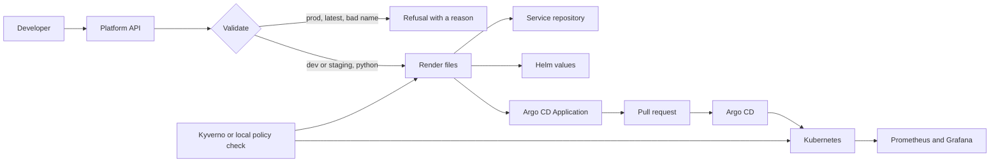

# Architecture

Meridian's platform group owns the golden path. Developers own the service name and the team. Nobody in this design owns a cloud credential on a laptop.



## What each box is allowed to do

| Piece | Writes | Must not |
| --- | --- | --- |
| Platform API | A request record and rendered files on disk | Talk to a cluster, hold a cloud key, accept `prod` |
| Template | A Python service with `/healthz` and `/readyz` | Invent a second runtime |
| Terraform | Local module outputs: name, labels, requests, limits | Require GCP to `terraform validate` |
| Helm | Deployment, Service, namespace, HPA | Ship an image tag of `latest` |
| Argo CD | The cluster, from Git | Be invoked by the API |
| Policy | A pass or a named failure | Be skipped because the demo is in a hurry |
| Prometheus / Grafana | Scrape and a dashboard | Be required for the API to accept a request |

## Request path

`POST /services` with:

```json
{
  "name": "billing-callback",
  "team": "payments",
  "runtime": "python",
  "environment": "dev"
}
```

Accepted requests return `status=accepted` and the relative paths of the rendered files. Refused requests return HTTP 422 and a `refusals` list the developer can read without asking the platform group.

`GET /services` and `GET /services/{id}` show the stored decision. A repeated `idempotency_key` returns the original decision and does not render a second tree.

## Local versus a later cluster

The demo path is Docker Compose or a virtualenv. `scripts/kind-up.sh` is the optional cluster path for Helm and Argo CD. It is not on the critical path of the metric.

`terraform/environments/gke` explains the optional GKE target. It is not initialized by the demo and it does not contain a required Google provider.
